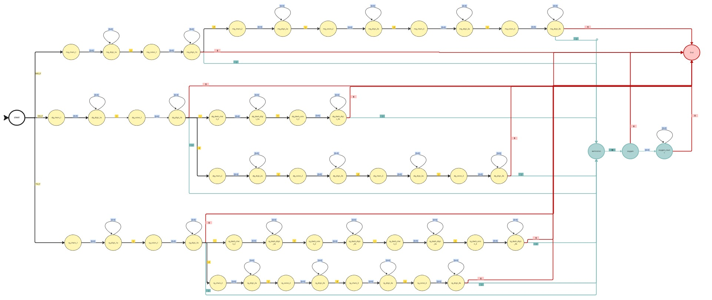
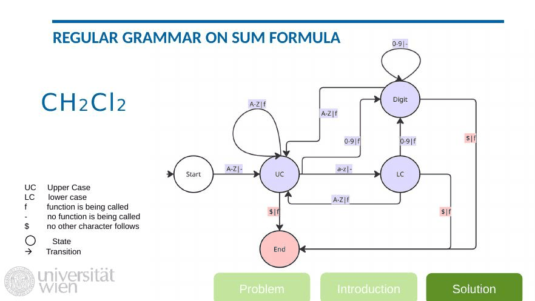

# Parsing chemical notations with regular grammars

Two small, self-contained demos of an idea from my master's thesis: describing a
formal notation with a **regular grammar**, compiling it to a **finite-state
machine (FSM)**, and parsing (or *validating*) input in a single linear pass, with
no backtracking and no parse table.

- **`parse_lipid.py`** validates **Shorthand2020 glycerolipid names** and
  *rejects malformed ones*. This is the interesting one.
- **`parse_formula.py`** parses **molecular sum formulas** like `CH2Cl2` and
  shows the parse time stays linear as the input grows.

> These are illustrations I built from my own teaching material and a slice of my
> thesis grammar. The full thesis parser (all lipid categories) isn't public yet;
> this shows the technique on a representative piece.

---

## 1. Validating lipid names: accepting the real, rejecting the fake

A glycerolipid name looks simple but has real structure. The separator says which
"level" you're describing, and the level dictates how many chains are allowed:

- `/` is *sn-position level* and requires **all three** chains.
- `_` is *molecular-species level* and fixes the **number** of chains (2 for DG, 3 for TG).
- the head group (`MG`, `DG` or `TG`) must be one the grammar knows.

`parse_lipid.py` reads the grammar in [`reg_GL_chains.g4`](reg_GL_chains.g4),
builds the FSM it describes, and uses it to decide whether a name is well formed:

```
$ python parse_lipid.py

  name                 verdict   why
  -------------------- --------- ---------------------------------------------
  MG 16:2;O            VALID     monoacylglycerol, species level with an oxygen
  MG 16:2/0:0/0:0      VALID     sn-position level: all three positions given
  DG 12:1_10:0         VALID     molecular species: DG needs exactly two chains
  TG 23:1              VALID     species level, one summed chain is fine
  DG 16:0/18:1;O2      REJECTED  unexpected ';' at position 10; it breaks the level's structure
  DG 12:1_10:0_0:0     REJECTED  unexpected '_' at position 10; it breaks the level's structure
  TG 23:1/12:0         REJECTED  the name ends too early; a required chain is missing
  MG                   REJECTED  chains are missing
  RG 12:1              REJECTED  'RG' is not a valid glycerolipid head group
```

Every one of those rejections is a name that *looks* plausible. `TG 23:1/12:0`
is a perfectly reasonable-looking lipid; it's only invalid because `/` commits
you to three chains and only two are given. That's the kind of rule the FSM
enforces automatically.

Check your own:

```bash
python parse_lipid.py "DG 12:1_10:0"        # VALID
python parse_lipid.py "TG 23:1/12:0" -v     # REJECTED, with the reason
```

### Why a grammar and not a regex

Regular grammars and regular expressions describe the same class of languages, so
this isn't a claim that a regex *couldn't* do it. The point is practical: a regex
that correctly validates lipid names across head groups, levels, ether prefixes
and oxygen trailers becomes enormous and unreadable, and in practice lets
malformed names slip through. The grammar makes every rule explicit and auditable.

Below is a simplified schematic of the glycerolipid FSM. It shows the branching
per head group and per level; ether prefixes and detailed oxygen handling are
left out for clarity, so treat [`reg_GL_chains.g4`](reg_GL_chains.g4) as the
authoritative version.



Even simplified it's large, and that's the point: every path is a rule you can
point at and check, instead of a hundred-character regex nobody can safely change.

---

## 2. Sum formulas: the same idea, and why it's linear

The sum-formula parser is the gentle version: `CH2Cl2` becomes `C:1, H:2, Cl:2`.
It walks the states `START, UC, LC, DIGIT, END`, one transition per character:



```bash
python parse_formula.py                 # parse a few examples
python parse_formula.py CH2Cl2 --trace  # watch the FSM step through it
python parse_formula.py --benchmark     # show the parse time stays linear
```

Because every character causes exactly one transition, an *n*-character formula
costs *O(n)*:

```
  length (chars) | time per parse
              60 |    0.064 ms
           6,000 |    4.433 ms
          60,000 |   35.467 ms
```

A context-free parser would build a table over every substring, which is the
difference that motivated the linear-grammar approach in my thesis.

---

## Files

- `parse_lipid.py` validates glycerolipid names against `reg_GL_chains.g4` and rejects malformed ones
- `reg_GL_chains.g4` is the Shorthand2020 glycerolipid grammar (ANTLR syntax)
- `gl_fsm.jpg` is a simplified schematic of the glycerolipid state machine
- `parse_formula.py` is the sum-formula FSM parser and event handler
- `reg_sumFormula.g4` is the sum-formula grammar
- `fsm_walkthrough.gif` shows the sum-formula FSM parsing `CH2Cl2`, step by step

Pure Python 3, no dependencies:  `python parse_lipid.py`
